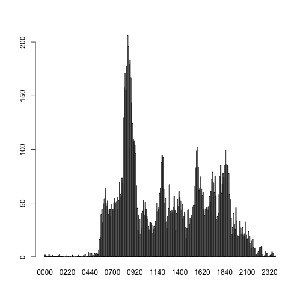

---
output:
  html_document:
    keep_md: yes
---
#Loading and preprocessing the data


```r
library("stringr")
data <- read.csv("activity.csv", stringsAsFactors = FALSE, na.strings = "NA")
data$date <- as.POSIXct(strptime(data$date, "%Y-%m-%d"))
data$interval <- str_pad(data$interval, 4, "left", "0")
```

#What is mean total number of steps taken per day?
Here's a histogram of the total number of steps taken each day.

```r
hist(data$steps)
```

 

As for the mean and median total number of steps taken per day:

```r
mean(data$steps, na.rm = TRUE)
```

```
## [1] 37.3826
```

```r
median(data$steps, na.rm = TRUE)
```

```
## [1] 0
```

#What is the average daily activity pattern?
Make a time series plot (i.e. type = "l") of the 5-minute interval (x-axis) and the average number of steps taken, averaged across all days (y-axis)

```r
dt <- sapply(split(data$steps, data$interval), mean, na.rm = TRUE)
barplot(dt)
```

 

Which 5-minute interval, on average across all the days in the dataset, contains the maximum number of steps?

```r
dt[grep(max(dt), dt)]
```

```
##     0835 
## 206.1698
```

#Imputing missing values
The total number of missing values in the dataset

```r
length(data$steps[is.na(data$steps)==TRUE])
```

```
## [1] 2304
```

Use mean of total steps to fill the missing value.

```r
data2 <- data
data2$steps[is.na(data$steps)] <- mean(data$steps, na.rm = TRUE)
```

Make a histogram of the total number of steps taken each day and Calculate and report the mean and median total number of steps taken per day.

```r
hist(data2$steps)
```

 

```r
mean(data2$steps, na.rm = TRUE)
```

```
## [1] 37.3826
```

```r
median(data2$steps, na.rm = TRUE)
```

```
## [1] 0
```

#Are there differences in activity patterns between weekdays and weekends?
Create a new factor variable in the dataset with two levels – “weekday” and “weekend” indicating whether a given date is a weekday or weekend day.

```r
weekday <- weekdays(data$date)
weekday[weekday!=c("Saturday", "Sunday")] <- "weekday"
weekday[weekday==c("Saturday", "Sunday")] <- "weekend"
data <- cbind(data, weekday)
```
Make a panel plot containing a time series plot (i.e. type = "l") of the 5-minute interval (x-axis) and the average number of steps taken, averaged across all weekday days or weekend days (y-axis).

```r
wd <- aggregate(steps ~ weekday + interval, data = data, FUN = "mean")
par(mfrow = c(1,2))
with(wd[wd$weekday == "weekday",], plot(interval, steps, type = "l",
                                              main = "weekday"))
with(wd[wd$weekday == "weekend",], plot(interval, steps, type = "l", 
                                              main = "weekend"))
```

 
